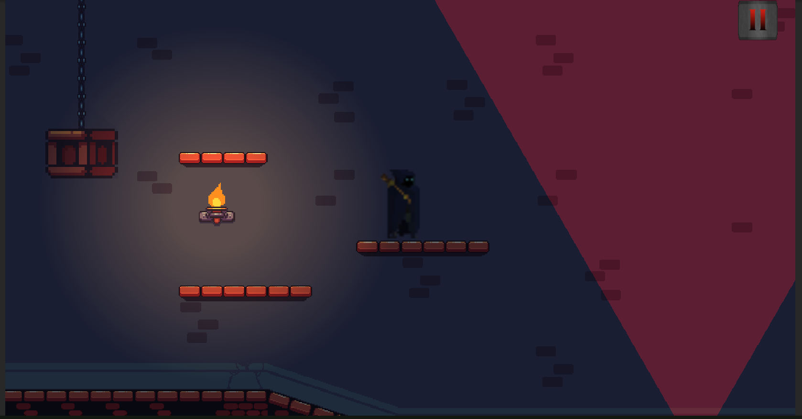

# Shadow of Darkness
A 2D platformer game in which you have to complete the level without touching the lights.

# Instructions for the game
- Player movement using WASD keys.
- Player attack using Left Mouse button.

# Implementation and Design Patterns used
- Used Lightings.
- Used 2D Universal Rendering Pipeline.
- Used Shadow-Caster for the shadows.
- Used Hinge Joints for making the chain.
- Used Raycast to detect the player colliding with light or not.

